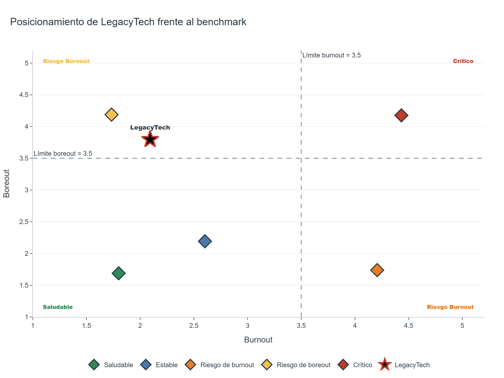
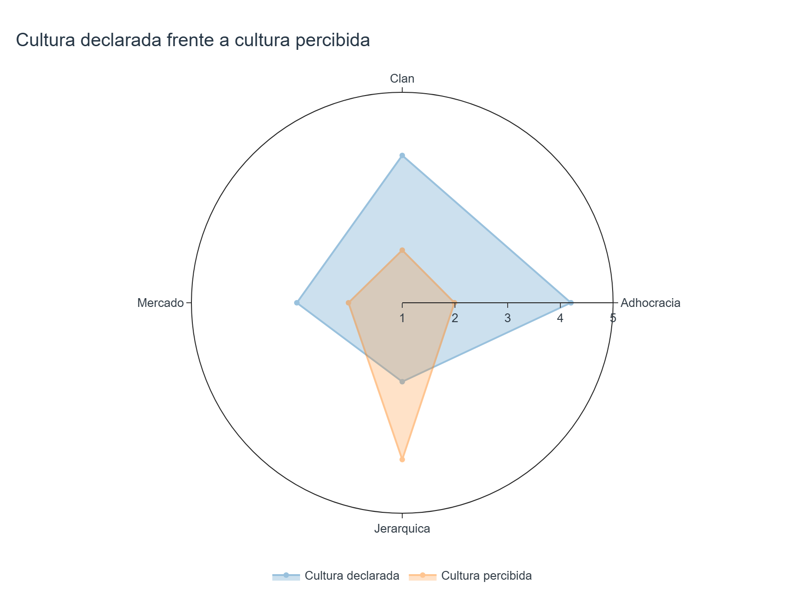
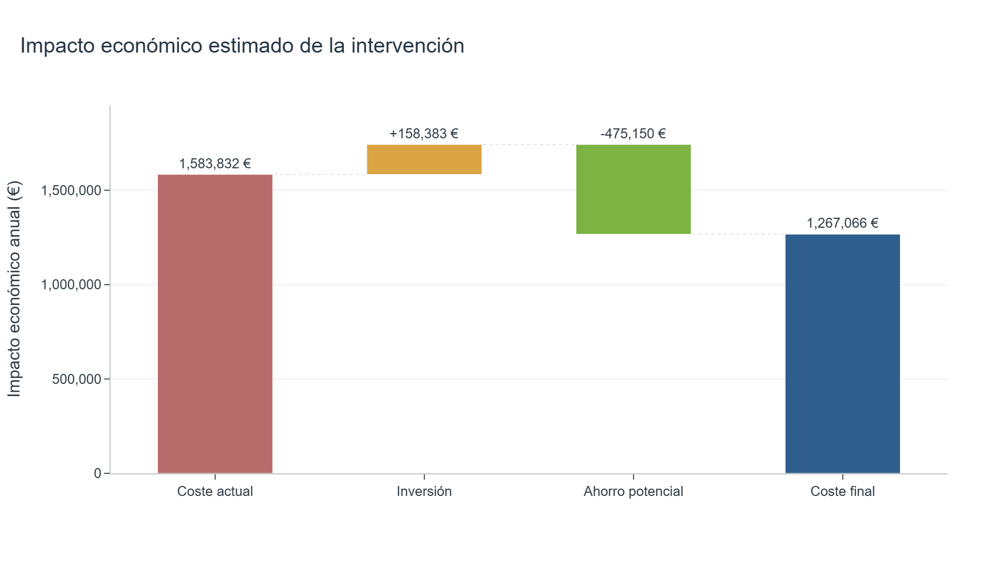
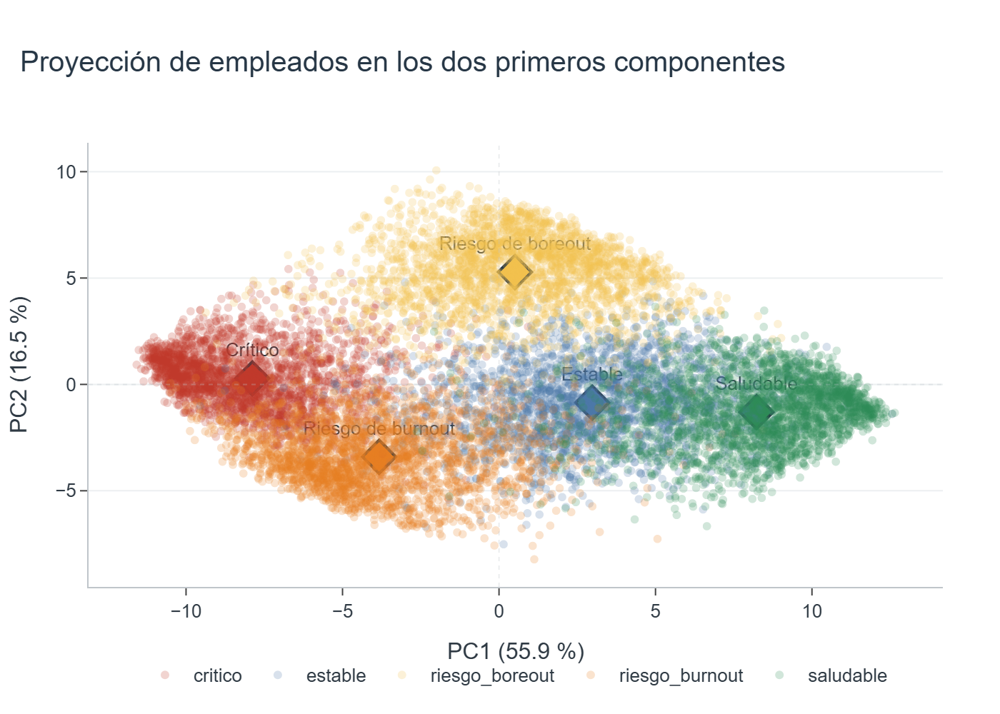

# 📊 EBLET
## Herramienta de Bienestar Laboral y Experiencia en el Trabajo

> Framework de **People Analytics** para la evaluación del bienestar laboral, la cultura organizacional y el riesgo de rotación mediante analítica de datos y modelos psicométricos validados.

---

## 🎯 Descripción

EBLET es un proyecto de **Data Analytics aplicado a Recursos Humanos** cuyo objetivo es proporcionar una herramienta capaz de evaluar el estado de una organización a partir de las respuestas de sus empleados.

El framework integra diferentes instrumentos psicométricos ampliamente utilizados en investigación para medir:

- 🔥 Burnout
- 😴 Boreout
- 💚 Bienestar laboral
- 🏢 Cultura organizacional (Competing Values Framework - CVF)
- 🔄 Riesgo de rotación
- 💰 Costes económicos asociados a la rotación

La información obtenida se compara con un **benchmark sintético** desarrollado específicamente para este proyecto, permitiendo situar a la organización respecto a distintos escenarios organizacionales.

---

# 🚀 Objetivos del proyecto

- Diseñar un framework reproducible de People Analytics.
- Construir un benchmark organizacional mediante datos sintéticos.
- Automatizar el cálculo de indicadores organizacionales (KPIs).
- Estimar el impacto económico de la rotación.
- Analizar la percepción de la cultura organizacional.

---

# 🧠 Arquitectura del proyecto

```
Organización / Persona
            │
            ▼
      Encuesta EBLET
            │
            ▼
 Procesamiento automático
            │
            ▼
      Cálculo de KPIs
            │
            ▼
 Benchmark + Comparación

```
## 📷 EBLET en acción

El framework genera visualizaciones que facilitan la interpretación del estado de bienestar de una organización y apoyan la toma de decisiones basada en datos.

### Mapa de posicionamiento organizacional




### Comparación entre cultura declarada y cultura percibida

El framework compara la cultura declarada por la organización con la cultura realmente percibida por los empleados, permitiendo identificar posibles desalineaciones.



### Estimación de impacto económico

Además del diagnóstico organizacional, EBLET estima el impacto económico asociado a la rotación de personal, facilitando la priorización de acciones de mejora.


---

# 📦 Versiones del sistema

## 🏢 EBLET Enterprise

Pensado para organizaciones.

Permite:

- evaluación completa mediante 67 preguntas Likert
- cálculo de KPIs organizacionales
- análisis por departamentos
- análisis por seniority
- estimación de costes de rotación
- análisis de cultura declarada vs. percibida
- comparación con benchmark

---

## 👤 EBLET Lite

Versión individual.

Permite a cualquier profesional conocer su situación respecto a:

- Burnout
- Boreout
- Bienestar
- Contexto laboral
- Riesgo de rotación
- Cultura organizacional percibida

---

# 📊 KPIs calculados

El framework calcula automáticamente:

| KPI | Descripción |
|------|-------------|
| 🔥 Burnout | Agotamiento, cinismo e ineficacia profesional |
| 😴 Boreout | Aburrimiento e infraocupación |
| 💚 Bienestar | Bienestar psicológico y satisfacción laboral |
| 🔄 Rotación | Intención de abandono |
| 🏢 Contexto | Calidad del entorno organizacional |
| 💰 Costes | Estimación económica de la rotación |

---

# 📈 Benchmark organizacional

Para contextualizar los resultados obtenidos, el proyecto incorpora un benchmark sintético diseñado específicamente para EBLET, compuesto por:

- 250 organizaciones
- 12.500 empleados
- 837.500 respuestas simuladas
- 5 escenarios organizacionales

Los escenarios son:

- 🟢 Saludable
- 🔵 Estable
- 🟡 Riesgo de Boreout
- 🟠 Riesgo de Burnout
- 🔴 Crítico


### Representación del benchmark mediante PCA

La reducción de dimensionalidad mediante Análisis de Componentes Principales (PCA) permite visualizar la separación entre los distintos escenarios organizacionales utilizados en el benchmark.




---

# 🔬 Validación estadística

El benchmark ha sido validado mediante diferentes técnicas estadísticas:

- Estadísticos descriptivos
- Matrices de correlación
- ANOVA
- Alfa de Cronbach
- Análisis de Componentes Principales (PCA)
- Análisis factorial

---

# 🛠️ Tecnologías utilizadas

- Python
- Pandas
- NumPy
- Plotly
- Scikit-Learn
- Streamlit
- Google Forms
- OpenPyXL

---

# 📁 Estructura del proyecto

```
EBLET/
│
├── datasets/
├── notebooks/
├── src/
├── README.md
└── requirements.txt
```

---

# 📚 Instrumentos psicométricos

El framework integra escalas ampliamente utilizadas en la literatura científica:

- MBI-GS (Burnout)
- WHO-5 (Bienestar)
- Escala de Aburrimiento Laboral (EAL)
- Autoeficacia (Bandura)
- Intención de Rotación (Mobley)
- Competing Values Framework (Cameron & Quinn)

---

# 💡 Principales funcionalidades

✔ Generación automática de datasets sintéticos.

✔ Benchmark organizacional.

✔ Clasificación automática de escenarios.

✔ Evaluación individual.

✔ Evaluación organizacional.

✔ Cálculo de costes de rotación.

✔ Comparación con benchmark.


---

# 📄 Documentación

La documentación técnica y metodológica se encuentra distribuida entre los notebooks del proyecto y este repositorio.

---

# 👨‍💻 Autora

**Marta Torrente**

IT Academy - Data Analytics -

2026

---